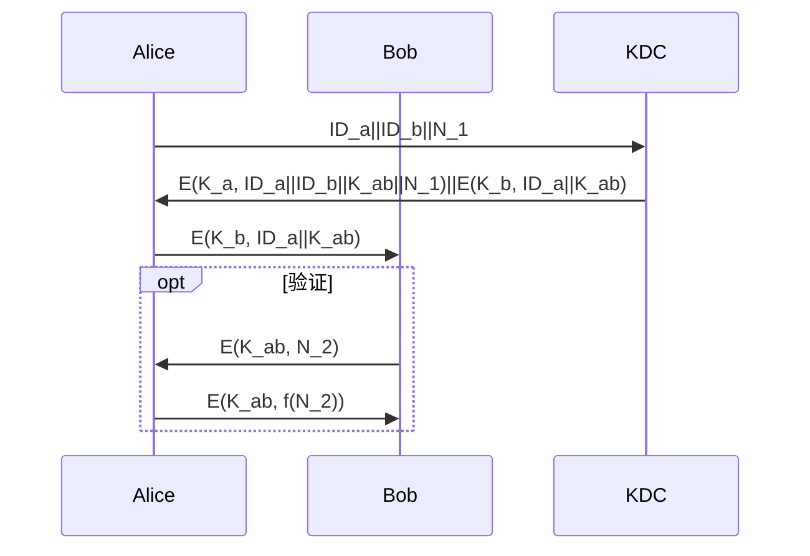
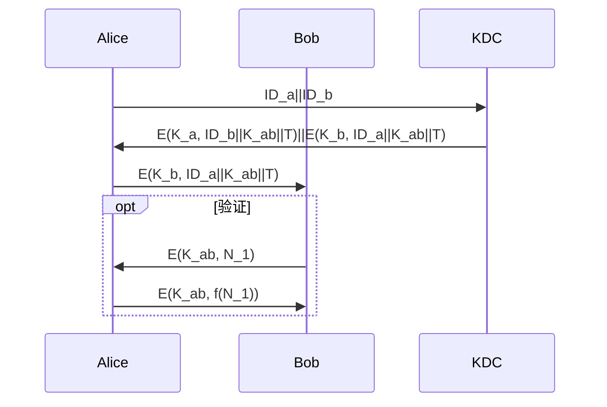
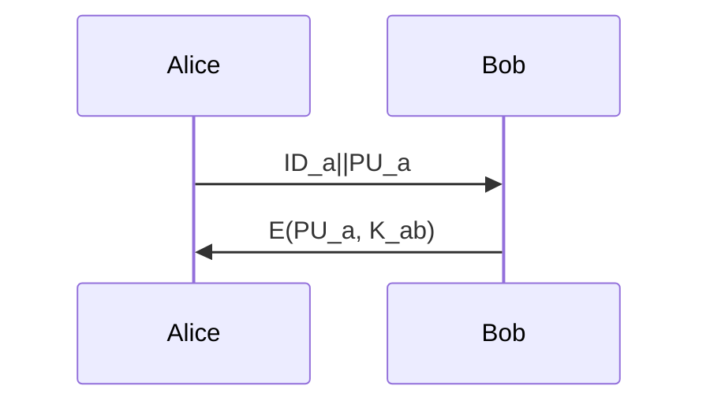
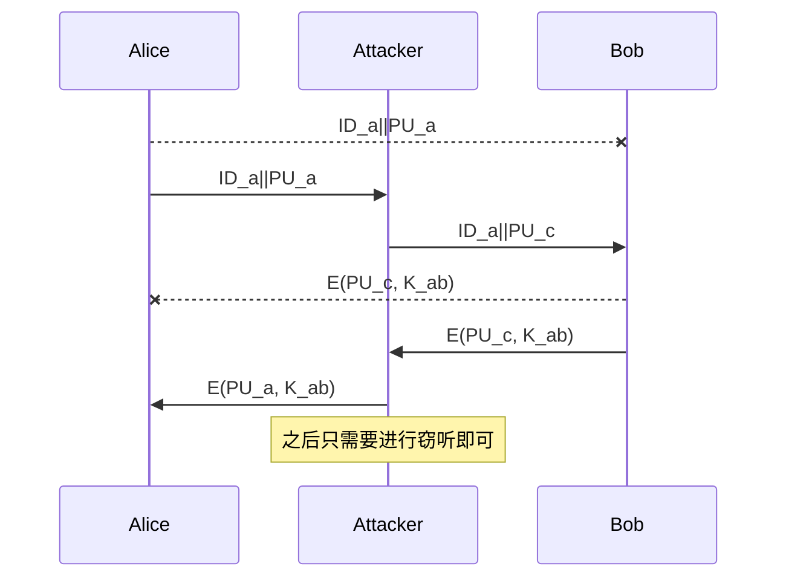
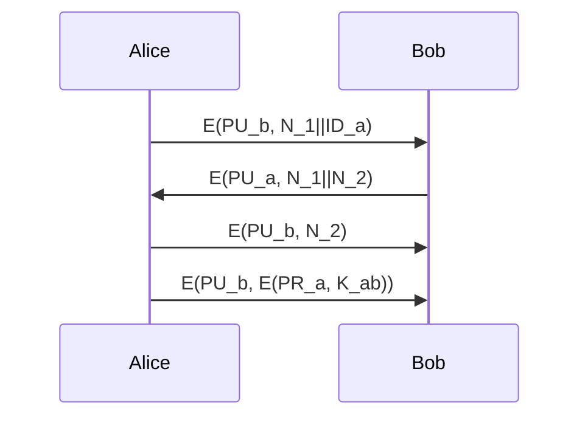
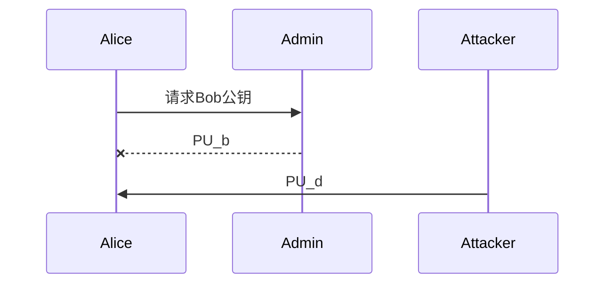
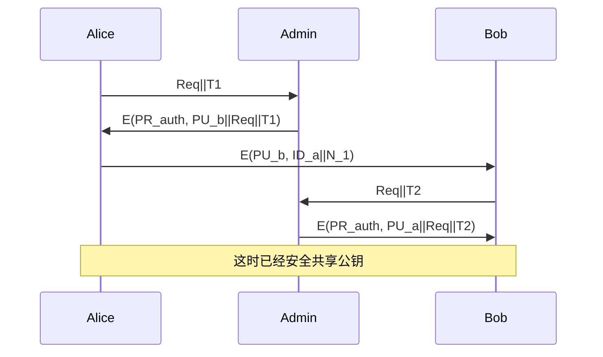
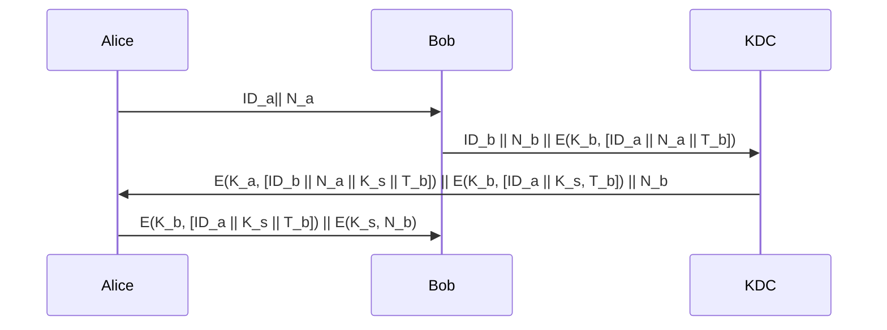
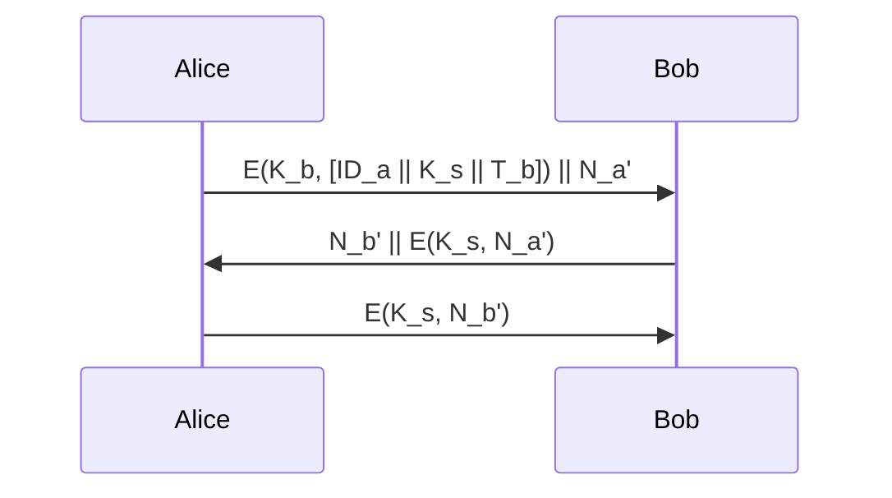

# Crypto_Final_1-3


## 复习计划

- 古典密码、对称密码
- 一些数学基础、非对称密码
- 非加密部分
- 往年题目和补充

### 题目对应知识点

- 2020
    - 重放攻击的防范 3
    - 古典密码密钥空间计算 1
    - 数学基础知识 2
    - Fiestel 结构分析 1
    - RSA 2
    - GF(p^n)上的计算 2
    - MAC 分析 3
    - RSA签名伪造 2
    - 密钥分发过程分析 3
- 2021
    - 古典密码密钥空间计算 1
    - 数学基础知识 2
    - RSA 2
    - GF(p^n)上的计算 2
    - 数字签名分析 3
    - 哈希函数分析 3
    - RSA签名伪造 2
    - RSA 累加器分析 4

## 古典密码


### 凯撒密码

- 加密过程：c = p + k mod 26
- 解密过程：p = c - k mod 26

- 明文空间 [0, 26)
- 密文空间 [0, 26)
- 密钥空间 [0, 26)

```
p + k mod 26
= (p mod 26 + k mod 26) mod 26
= (p + k mod 26) mod 26

如果 k1 = k2 (mod 26)
```

每次加密的单位是一个字符：

- p1(长度32) 使用 k 加密，得到c1(长度32)
- p2(长度1) 使用 k 加密，得到c2(长度1)

攻击方式：

- 已知一组明文-密文对即可反推密钥
    - c = p + k mod 26
    - c - p = k mod 26
    - k = c1 - p1 mod 26
    ```
    tatbtc
    -----d
    ```
- 密钥空间太小，穷举
- 频率分析
    ```
    tatbtc
    ubucud
    ```

### 仿射密码

- 加密过程：c = a*p + b mod 26
- 解密过程：p = (c - b) * inverse(a) mod 26
- 解密正确性：
  - c = a*p + b mod 26
  - c - b = a*p mod 26
  - (c-b)\*inverse(a) = a\*inverse(a)\*p mod 26
  - (c-b)*inverse(a) = p mod 26

- 明文空间 [0, 26)
- 密文空间 [0, 26)
- 密钥空间：
    - Ek = (a,b)
    - Dk = (a' , b)  # a' = inverse(a, 26)
    - 因此需要 a 对 26 有逆
    - 共有12*26种密钥

- 密钥恢复攻击：如果需要恢复仿射密码的密钥，需要收集两组 p-c 对。

```
c1 = a*p1 + b mod 26
c2 = a*p2 + b mod 26

(c2 - c1) = a*(p2 - p1) mod 26
(c2 - c1)*(inverse(p2 - p1)) = a mod 26


----
如果 p2-p1 对 26 没有逆元：

a = 1, b = 0
    p1 = 1 c1 = 1
    p2 = 3 c2 = 3

a = 3, b = 3
    p1 = 1 c1 = 6
    p2 = 3 c2 = 12

6  = a*1 + b mod 26
12 = a*3 + b mod 26
6 = a*2 mod 26

注意，此时有多解：
    6 = 3*2 mod 26
    6 = 16*2 mod 26
a1,b1 = 3,3
a2,b2 = 16,16
```

- 穷举：虽然相比凯撒密码，密钥空间扩大，但仍旧太小。
- 频率分析攻击

### 维吉尼亚密码

- 类似凯撒，加上密钥
  - plain "aaabcbcdefefef"
  - key "abc" -> "0 1 2"
  - cipher "abcbdd"
- 如果key和明文等长，类似一次一密，但是没有实际使用价值，保护和明文等长的key和直接保护明文代价是一样的
- 实际应用中，key会被循环利用，因此攻击者可以对密文进行分组，每一个分组是使用同样key的凯撒密码，那么，分析针对凯撒密码的攻击
    - 已知一对明文-密文：有效，整个分组的key泄露，整个分组都可被恢复
    - 穷举攻击：难以实现，虽然每个分组密钥理论只有26种，但是分组处理之后的明文不再具有实际意义，即使遍历所有可能明文，也没法识别出来
    - 频率分析：有效，虽然单词本身被打乱，但是字符的统计规律不会改变，依然可以频率分析

- 密钥空间: 和长度有关，如果长度是 L，key是26个字母组成的单词,那么，密钥有 26^L 种。

### 简单的置换-栅栏

- 纵向写，横向读。
- key为栅栏深度
- 加密

```
  明文:abcdefg
  2层栅栏：
  a c e g
  b d f
  密文:acegbdf
  ----------
  明文：ls rm clear
  栅栏：
  l mcer
  sr la
  密文：l mcersr la
```

### 复杂的置换

- 类比栅栏，可以认为是纵向写，横向按照特定顺序读
- key的长度为栅栏深度，key的内容为读的顺序
- 加密

```
  明文: abcdefg
  key为：[2,1]
  加密:
  2 a c e g
  1 b d f
  密文：bdfaceg
  对于一个密钥长度为n的置换加密，n!。
```

### 希尔密码

- key为一个可逆矩阵
- c = A * p
- (A^-1)c = (A^-1)\*A\*p
- p = A^-1 * c

- plain: [1, 3, 8, 5, 6, 7,2, 4, 9]

```
[[1,5,2],
[3,6,4],
[8,7,9]]
```

- K(3x3)
- C(3x3) = K(3x3) * P(3x3)
- K'(3x3)\*C(3x3)=K'\*K \* P(3x3)

```
单位阵：
1 0 0
0 1 0
0 0 1
K:
0 1 0
1 0 0
0 0 1
P:
1 5 2
3 6 4
8 7 9
(加密)C = K*P:
3 6 4
1 5 2
8 7 9
(解密)P = (K^(-1))*C
```


- 密钥空间：
    - $GL(n,Z_{29})$ = (29^6-1)\*(29^6-29)...\*(29^6-29^5)
    - 上面这个乘法的每一项代表一列，每一列理论最多有29^6种可能，第一列要去除全0的场景，第二列去除第一列的线性组合29，第三列去掉前两列的线性组合29^2 。。。以此类推
    - 例如作业1中，明文被编码到 [0, 29)，因为希尔密码使用可逆矩阵作为密钥，密钥空间的大小就是可逆矩阵的数量。
    - 这和矩阵的大小以及矩阵内原始的数量都有关系。

### 题目示例

#### 2020-Final-2


- 维吉尼亚密码
  - GF(29)
  - 长度在m1-m2之间
    - m1-m2
    - 对于任意mi，密钥空间都有29^mi-1种
    - 从m1到m2的所有可能长度的所有可能密钥的和，我们假设长度包含m1 不包含 m2
    - 29^m1+....29^(m2-1) - (m2-m1)
  - 只有密钥全0的情况下，才是平凡的
  - 所以假设密钥长度为m4，每位密钥都有29种可能，密钥为29^m4种，非平凡的有29^m4-1种

- 置换密码
  - GF(29)
  - 长度为m3
  - 长度m3的序列，每一个排列都是一种密钥
  - 只有顺序排列的情况下，并且明文长度不超过密钥长度，才是平凡的，不考虑这种情况。
  - 所以密钥的数量和长度为m3的序列的全排列数量相等，有 m3! 种，非平凡的有m3!种

- 两者混合
  - 相继应用两种算法，等于同时拥有两个密钥，其中k1有29^m4种,k2有m3!种
  - 只有两个k都是平凡的，这个算法才会有一个平凡的key
  - 所以混合密码，密钥有（29^m4)*(m3!) 种

#### 2021-Final-1


可以看到，两次的题目基本一致，仅数值变化。

## 对称密码

### 一次一密

选择和明文二进制等长的密钥，然后 `C = P xor K`。

#### 无条件安全

如果攻击者对一次一密暴力破解，当他遍历所有密钥的同时也遍历了等长度的所有可能信息，攻击者无法从中识别出明文。

#### 密钥配送问题

如果存在安全的方式交换和明文等长的密钥，为什么不直接交换明文？

#### 密钥不可复用

```
C1 = P1 xor Key
C2 = P2 xor Key
C1 xor C2 = P1 xor Key xor P2 xor Key
C1 xor C2 = P1 xor P2
P2 = P1 xor C1 xor C2 (已知一对明文密文)
```

#### 比特翻转攻击

```
A借B 1000 元
1 对应明文 '00110001'
假设此段key为 '10000111'
对应密文：'10110110'
攻击者篡改其中一个bit，新密文为：'10111110'
解密前没有检查是否被篡改，直接解密，得到：'00111001'，对应字符 9
明文变成了： A借B 9000 元
所以，需要保证密文的完整性。
```

### 流密码

- 延续一次一密的思路，如果可以使用较短的密钥生成较长的随机比特流，就可以使用这样的比特流进行加密
- 因为密钥长度远小于比特流长度，所以可以使用安全的方式交换

### feistel结构

- 代替和置换 - substiution&permutation
- 混淆和扩散 - confusion&diffusion (对于DES 分别由 S-box 和 P-box 提供)
- L(i+1), R(i+1) = R(i), L(i) xor f(R(i), ki)
- 最后一轮结束后再次交换（也可以认为最后一轮不交换）


### DES

- 数据加密标准
- 用到了16轮feistel结构
- 密钥长度是64，其中包含8个校验位

#### 针对DES的攻击

- 有效密钥长度 56
- 线性分析 2^43
- 3DES
  - EDE 兼容 DES
  - 中间相遇攻击 安全强度

```
加密：
已知P
t1 = DESEnc(P, K1)

t2 = DESDec(t1, K2)
C  = DESEnc(t2, K3)

解密：
已知C
t2 = DESDec( C, K3)
t1 = DESEnc(t1, K2)
P  = DESDec(t1, K1)

兼容DES:
已知P
t1 = DESEnc(P, K1)
P  = DESDec(t1, K1)
C  = DESEnc(P, K1)
```

- 1 DES
  - 遍历所有2^56种可能的密钥，E(P, [Ki]) == C

- 3 DES
  - 遍历2^(56*3)种， E(D(E(P, [K1i]), [K2i]), [K3i]) == C
  - 中间相遇攻击：
    - 遍历所有2^56种可能的密钥， C1  = E(P, [K1i]) , 得到2^56种C1,存进hash tbl
    - 遍历2^(56*2)种可能的密钥，D(E(C, [K3i]), [K2i]) in hash tbl, K1,K2,K3

``` python
集合 A 存在若干数字，要求找出 a, b 两个数字，a + b == c。
遍历 A 的同时，把 c - a 存入哈希表，再次遍历 A，如果发现 b 在哈希表中，则找到一对满足条件的 a, b。
```

### AES

- 高级加密标准
- 支持 128,192, 256 三种长度的密钥
- AES 没有使用feistel结构，有轮的概念，每轮做下面操作：
    - 行替换
    - 列混淆
    - 字节代换
    - 轮密钥加

### 加密模式

- 用于块密码
- P = P1 | P2 | P3 ...
- C = C1 | C2 | C3...

#### ECB


  - 简单直观
  - C[i] = E(P[i], k)
  - P[i] = D(C[i], k)
  - 密文的一个比特错误，导致一个明文分组错误，但是不会影响其他明文分组。
  - 加解密都可以并行。
  - 对于相同的明文，会被加密成相同的密文。

####  CBC


  - 借用上一个分组的加密结果，获取不同的明文
  - C[i] = E((P[i] xor C[i-1]), k)
  - P[i] = D(C[i], k) xor C[i-1]
  - IV （不能重复使用）
    - 充当C[0]
    - 避免第一个分组每次都一样，如果IV重复使用，则这一点无法保证。
  - 密文的一个比特错误，对应明文分组错误，下一个明文分组的一个比特错误，后续分组不受影响。
    - 假设C[2] 一个比特错误
    - P[2] = D(C[2], k) xor C[1] 整个分组错误。
    - P[3] = D(C[3], k) xor C[2] 一个比特错误。
    - P[4] = D(C[4], k) xor C[3] 后续分组不受影响。
  - 计算:
    - 加密： C[i] = E((P[i] xor C[i-1]), k), 计算一个分组的密文，依赖前一个分组的密文。不能并行。
    - 解密：P[i] = D(C[i], k) xor C[i-1], 需要两个分组的密文，都是已知的，所以可以并行解密。

  - 比特翻转攻击
    - 和流密码或一次一密类似，攻击者可以翻转密文的某个比特，使得下一个分组对应明文的一个比特翻转。
      - xxxxxxxxxxxxxxxxxxxxx username = xxx, isadmin = 0
      - doihfiljfo;sdjvifjoooooo1 username = xxx, isadmin = 1
      - 因为会影响前一个明文分组，所以比较容易识别

##### Padding Oracle Attack *

- 填充提示攻击
- 如果不满一个分组，怎么办 - padding？
- 利用 padding 错还原明文。


#### CFB


  - C[i] = P[i] xor E(C[i-1], k)
  - P[i] = C[i] xor E(C[i-1], k)
  - 密文的一个比特错误，对应明文分组一个比特错误，下一个明文分组错误，后续分组不受影响
    - 假设C[2] 一个比特错误
    - P[2] = C[2] xor E(C[1], k) 一个比特错误
    - P[3] = C[3] xor E(C[2], k) 整个分组错误
    - P[4] = C[4] xor E(C[3], k)后续分组不受影响。
  - 计算：
    - 加密：C[i] = P[i] xor E(C[i-1], k)，计算一个分组的密文，依赖前一个分组的密文。不能并行。
    - 解密：P[i] = C[i] xor E(C[i-1], k)，需要两个分组的密文，都是已知的，所以可以并行解密。

#### OFB


  - C[i] = P[i] xor E^i(IV, k) # E^i 指连续加密i次
  - P[i] = C[i] xor E^i(IV, k)
  - 密文的一个比特错误，对应明文分组一个比特错误，不影响其他分组
    - 假设C[2] 一个比特错误
    - P[2] = C[2] xor E^2(IV, k) 一个比特错误
    - P[3] = C[3] xor E^3(IV, k) 后续分组均无影响
  - 计算：
    - 加密：C[i] = P[i] xor E^i(IV, k) ，虽然异或很快且可以并行，但是需要生成密钥流，问题在于密钥流每生成一个分组，都需要前一个密钥分组，所以这一步不可并行
    - 解密：同加密
    - 密钥流产生和明文无关，所以加密方可以预先计算
  - 比特翻转攻击：流密码的特性
  - IV 不能重复

#### CTR


  - C[i] = P[i] xor E(Counter[i], k)
  - P[i] = C[i] xor E(Counter[i], k)
  - 密文的一个比特错误，对应明文分组一个比特错误，不影响其他分组
    - 假设C[2] 一个比特错误
    - P[2] = C[2] xor E(Counter[2], k)一个比特错误
    - P[3] = C[3] xor E(Counter[3], k) 后续分组均无影响
  - 计算：
    - 加密：C[i] = P[i] xor E(Counter[i], k)， 可以并行
    - 解密：P[i] = C[i] xor E(Counter[i], k)， 可以并行
    - 密钥流产生和明文无关，所以加密方可以预先计算
  - 比特翻转攻击：流密码的特性
  - IV 不能重复，否则出现密钥流重复


### 题目示例

#### 2020-Final-4


- a: 安全(保证机密性)和可用(有应用场景，效率高)

- b

```
Ln = Ro
Rn = Lo xor f(k, Ro)

已知Ln,Rn

因Ln = Ro：Ro = Ln, f(k, Ro) = f(k, Ln)
因Rn = Lo xor f(k, Ro)
  Lo = Rn xor f(k, Ro)
  Lo = Rn xor f(k, Ln)

Lo = Rn xor f(k, Ln)
Ro = Ln
```


```
绘制Fiestel结构解密图:
R3, L3 = O1, O2
R2, L2 = L3, R3 xor f(L3, k2)
R1, L1 = L2, R2 xor f(L2, k1)
I1, I2 = L1, R1
```


## 数学基础

###  整除相关计算

`a|b` 读作a整除b，这时 b = k\*a，那么有以下结论

- 如果`a|1`那么 a = 1 或 a = -1
- 任意a，满足`a|0`
- 如果`a|b`,`b|c` 那么 `a|c`
- 如果`a|b`,`a|c` 那么 `a|(sb+tc)`

$$
a\ \equiv \ b \ (mod\ c)
$$

- n|(a-b) -> a=b mod n
  - b = k1*n + c a = (k1+(a-b)/n)\*n + c
- a = b mod n,  b=c mod n -> a=c mod n
- a+b mod n = ((a mod n) + (b mod n)) mod n

a = b mod n
a\*c = b\*c mod n

上面这个性质对加、减、乘均成立，但是：

```
18 = 48 mod 10
3 != 8  mod 10
```

对于除法：

```
ac = bc mod m
a = b mod (m/gcd(c,m))
```

例题：计算 3 ^ 123456789 mod 80

```
3^4 = 81
3^4 = 1 (mod 80)
3^4 * 3^123456785 (mod 80)
1 * 3^123456785 (mod 80)
3^(123456789 % 4) (mod 80)
---
关注点转移到：123456789 % 4
1234567*100 + 89 % 4
20 * 4 + 9 % 4
2*4 + 1 % 4
---
3 ^ 1 % 80 = 3
```

### 算数基本定理

- 任意正整数可以表示成若干个 1 的加法，因此 `1` 是加法的基本单位。
- 素数则是乘法的基本单位，任意正整数可以分解成若干素数的乘积。

```
m = p1^a1 * p2^a2 ... pn^an
```

任意正整数都可以得到这样的分解，并且已知正整数的分解后，恢复这个整数是容易的。
但是如果只知道整数，要得到它的分解，这是一个数学上的困难问题。

``` python
def fac(n):
    result = []
    while n != 1:
        for i in range(2, n + 1):
            if n % i == 0:
                result.append(i)
                n //= i
                break
    return result
```

### 欧拉定理

如果 `gcd(a, n) == 1`:

$$
a^{\varphi(n)}\ \equiv\ 1 \ (mod \ n)
$$

其中 $\varphi$ 称为欧拉函数。

#### 欧拉函数

- 定义欧拉函数 phi(n) 为小于n且和n互素的整数数量

- 7:  1 2 3 4 5 6 phi(7) = 6
- 6:  1 5 phi(6) = 2

- 如果p是素数， phi(p) = p-1
- 如果n = p1*p2，phi(n) = (p1-1)(p2-1)
- 如果n = p1*p2...，phi(n) = (p1-1)....
- 如果存在相同的p，n = (p1^i) \* p1, phi(n) = (p1^i)\*(p1-1)
    - 把不同的因子写到最前面，如果出现相同的，补到后面
    - p1^3\*p2^2\*p3^4 = (p1-1) (p2-1) (p3-1) p1^2 p2 p3^3

也可以直接使用下面的计算方式：

$$
\varphi(m) \equiv m\prod_{i=1}^n (1-\frac{1}{p_i})
$$
其中p为m的分解：m = p1^a1 p2^a2 ... pn^an

例题：n = 72283 求 phi(n) ?

```
显然：72283 = 41*41*43
phi(72283) = (41-1)*41*(43-1) = 68880
```

#### 证明

如果 a 和 p1 ... pn 均和 m 互素，那么 ap1 ... apn 均和 m 互素。
如果 p1 ... pn 恰好覆盖了 0-m 之间所有和 m 互素的数，则ap1 ... apn 对m取余后同样完成覆盖。
反证法，如果 api1 = api2 mod m，那么pi1 = pi2 mod m，这与前提矛盾。

```
api1 = k1m+b
api2 = k2m+b
a(pi1 - pi2) = (k2-k1)m
```

那么

$$
\prod_{i=1}^npi \equiv \prod_{i=1}^n a\ p_i (mod \ m)
$$

$$
\prod_{i=1}^np_i \equiv a^{\varphi(m)} \prod_{i=1}^n p_i (mod \ m)
$$

$$
a^{\varphi(m)} \equiv 1 (mod \ m)
$$

#### 费马小定理

- 费马小定理为欧拉定理特殊形式
  - 若m为素数，则phi(m) = m-1
  - p = m
  - pow(a, p-1, p) = 1

### 欧几里得算法


#### 欧几里得算法

- 对于 A、B，要求 GCD(A，B)
- 考虑 A = k*B + R
- GCD(A，B) = GCD(k*B + R, B) = GCD(B, R)

#### 扩展欧几里得算法

使用欧几里得算法可以求出 GCD(A，B)，扩展欧几里得算法给出一个构造性的证明，找到 s 和 t 满足 sA + tB = gcd(A, B)。

```
gcd(a, b) == gcd(b, a%b)

假设a,b最大公因数为T,gcd递归下降的终点为(1*T+y*0 == T) 1 * T+ y * 0 == T, 在gcd算法向上回溯的过程中总有：
# a 和 b 是每一次调用 gcd 时的入参
# x 和 y 为对应系数
T = nx*a + ny*b
T = x*b + y*(a%b)
这里 a%b 写成 a-k*b，其中 k = a//b,则
T = b*x + a*y - k*b*y
T = [y]*a + [(x-k*y)]*b
那么 nx, ny = y, (x-a//b*y),由此递推计算x, y
```

例题：a = 96 b = 35 ，应用 XGCD

|  a  |  b  |  x  |  y  |       等式        |
| --- | --- | --- | --- | ----------------- |
| 96  | 35  |     |     |                   |
| 35  | 26  |     |     |                   |
| 26  | 9   |     |     |                   |
| 9   | 8   | 1   | -1  | 9\*1+8\*(-1) == 1 |
| 8   | 1   | 0   | 1   | 8\*0+1\*1 == 1    |
| 1   | 0   | 1   | 0   | 1\*1+0\*0 == 1    |


|  a  |  b  |  x  |  y  |
| --- | --- | --- | --- |
| 96  | 35  | -4  | 11  |
| 35  | 26  | 3   | -4  |
| 26  | 9   | -1  | 3   |
| 9   | 8   | 1   | -1  |
| 8   | 1   | 0   | 1   |
| 1   | 0   | 1   | 0   |


#### 求逆元

我们的目标是对于 A 和 N 找到 A 的逆元 A'，使得 `A*A' = 1 (mod N)`。
扩展欧几里得算法对于给定 (a,b) 扩展欧几里得算法可以计算出 `a*x + b*y = gcd(a, b)`，那么，只要`gcd(A, N) == 1`，令 (a,b) 为 (A, N)，可以计算 `A*x + N*y = 1`，则 `A*x = 1 (mod N)`，x 即为一个满足条件的 A'。

> 一种利用费马小定理求逆元的方法：
> 如果N是素数，那么由于费马小定理，A^(N-1) = 1 mod N
> A * A^(N-2) mod N
> A' = A^(N-2) mod N

#### 代码实现

``` python
def XGCD(a, b):
    if (b == 0):
        return a, 1, 0
    gcd, x, y = XGCD(b, a%b)
    return gcd, y, x-a//b*y


def inverse(a, n):
    gcd, x, y = XGCD(a, n)
    return x%n if gcd == 1 else None
```
### 快速幂

朴素实现：

```python
def my_pow(a,b,c):
    t = 1
    for i in range(b):
        t *= a
        t %= c
    return t % c
```

问题：如果我们要计算 1024 个 b 相乘，使用上面的函数就需要计算 1023 次乘法。
考虑到：
b^1024 = b^512 * b^512
b^512 = b^256 * b^256
256
128
64
32
16
8
4
2
这样只需算10次乘法。

```
1024 : 0b10000000000
65537 : 0b10000000000000001
```

``` python
# for bit in b:
#    if bit == 1:
#        t *= m
#    m *= m
#a^b
#b个a相乘
#....k2*2^2+k1*2^1+k0*2^0
#(a^(ki*2^i))*(a^(kj*2^j))...

def my_fast_pow(a,b,c):
    t = 1
    for bit in bin(b)[2:][::-1]:
        if bit == '1':
            t *= a
            t %= c
        a *= a
        a %= c
    return t % c
```

### 题目示例

#### 2022-Practive-2


因为 n 是素数，所以 pow(a, n-1, n) == 1 mod n
所以 a * pow(a, n-2, n) == 1 mod n
所以 x = pow(a, n-2, n)

```
类似python代码：
def inverse(a, n):
    assert n is prime
    return pow(a, n-2, n)
---
类似伪代码：
    ret pow(a, n-2, n)
```


- None
- 8905
- 12
- -7 (4-6 补充看看能否根据上面内容推导出)

F3补充:

```
4 利用了 29 % 17 = 12:
12*17 + (-7)*29 = 1

12*(-7) = 1 mod 17


5 和 6 利用了上面的结论:
pow(12, 30, 31) = 1 -> 12 * pow(12, 29, 31) = 1 -> 逆为 13
pow(10, 30, 31) = 1 -> 10 * pow(10, 29, 31) = 1 -> 逆为 28
```


#### 2020-Final-3


```
a)
计算：a^(p-1) + (p-1)^a mod p
a是和p互素的奇数。
a^(p-1) + (p-1)^a mod p
= (a^(p-1) mod p + (p-1)^a mod p) mod p
= 1 + (-1) mod p
= 0 mod p
= 0


b)
此类题目一般将幂次降低之后使用带入法求解。
对于 f(x) = an*x^n ... = 0 mod p 的同余式，可以使用多项式因式分解的方式降幂，保证最大次数不高于p，方法如下：
根据费马小定理:
	x^p = x mod p
	x^p - x = 0 mod p

令 g(x) = x^p - x
则 f(x) = g(x)*p(x) + t(x) = 0 mod p
最终，问题转化成 t(x) = 0 mod p

对照这个问题：
f(x) = 3*x^14+4*x^10+6*x-18
g(x) = x^5 - x
则 t(x) = 7*x^2 + 6*x - 18

		  3*x^9+7*x^5+7*x
		  ---------------------
x^5 - x / 3*x^14+4*x^10+6*x-18
          3*x^14-3*x^10
       ------------------------
          7*x^10+6*x-18
          7*x^10-7*x^6
       ------------------------
          7*x^6+6*x-18
          7*x^6-7*x^2
       ------------------------
          7*x^2+6*x-18


手工带入得到：
x - t(x)%5
0 - 2
1 - 0
2 - 2
3 - 3
4 - 3

x = 1 (mod 5)


一次同余式，有通用解法，求逆再乘系数。
二次比较复杂。
```

#### 2021-Final-2


可以看到两年题目差异非常小。


## 非对称

1. 密钥配送问题
2. 共享密钥数量爆炸
3. 需要签名机制

### RSA 参数计算

- 利用了大数分解的困难性

1. 生成 p, q
2. 计算 n = p\*q
3. 计算 n 的欧拉函数, phin = (p-1)\*(q-1)
4. 生成公钥 e，和 phin 互素即可
5. 计算私钥 d，满足 e*d % phin = 1, 例如 d = inverse(e, phin)
6. 丢弃 phin p q
7. 保留 e, n 作为公钥， d 作为私钥

### RSA 应用

#### 加解密

- 加密: C = pow(P, e, n)
- 解密: P = pow(C, d, n)
- P2 = pow(pow(P, e, n), d, n)
- P2 = pow(P, e*d, n)
- P2 = pow(P, k*phin + 1, n)
- P2 = pow(pow(P, phin, n), k, n)*pow(P, 1, n)
- P2 = 1*P

(P ^ e % n) ^d  %n
(P ^ e) ^ d % n

#### 数字签名

- 签名: S = pow(M, d, n)
- 验证: M == pow(S, e, n)

### RSA 攻击

#### 直接分解

- 是一个困难问题
- 目前最高768bit
- http://www.factordb.com/

#### 参数选取不当导致的分解

- p,q 过近 -- 开方寻找
  - 利用pq两个数字都在根号n附近
- 重用因子 -- gcd分解
  - n1 = p1*p2
  - n2 = p1*p3
  - gcd(n1, n2) = p1
  - p1|n1， p2 = n1//p1


#### 明文枚举攻击

- 明文空间较小，枚举明文
  - e,d,n安全，但是m空间较小
  - 攻击者具有加密所需所有内容，除了明文
  - 攻击者枚举所有可能的明文，尝试加密，如果与已知密文相同，则可以确定明文

例： 明文是 "ABC" -> 0 + 1 \* 100 + 2\*10000 = 20100
相对不安全的编码方式： "ABC" -> [0, 1, 2]

#### 共模攻击

一种对 RSA 的错误使用方式。

```
1. 生成 p, q
需要生成大素数 p q。这个过程是很耗时间的。
2. 计算 n = p\*q
3. 计算 n 的欧拉函数, phin = (p-1)\*(q-1)
phin
4. 生成公钥 e，和 phin 互素即可
这个 e 会用于加密，计算时作为指数，因此 e 的二进制长度和其中比特 1 的个数会影响加密时间。
5. 计算私钥 d，满足 e*d % phin = 1, 例如 d = inverse(e, phin)
d 用于解密，计算时作为指数，因此 d 的二进制长度和其中比特 1 的个数会影响解密时间。
6. 丢弃 phin p q
7. 保留 e, n 作为公钥， d 作为私钥
```

m相同，N相同，使用互素的e发给不同用户，则不需要分解N即可还原。

- e1 e2 互素
- 用到 广义欧几里得算法

XGCD： 如果 e1 和 e2 互素，那么我们可以找到 s1 和 s2，令 e1\*s1 + e2\*s2 == 1

```
c1 = pow(m, e1, n)
c2 = pow(m, e2, n)

pow(c1, s1, n) == pow(m, e1*s1, n)
pow(c2, s2, n) == pow(m, e2*s2, n)

pow(c1, s1, n)*pow(c2, s2, n) = pow(m, e1*s1 + e2*s2, n) = m
```


---

如果 e1, e2 不互素，那么不能应用共模攻击。

但是，假定e1 = a\*b，e2 = a\*c
可以对b和c应用XGCD，计算出 pow(m, a, n)。

#### 利用计算的性质，侧信道攻击

```
pow(m, d, n)
t = 1
for bit in d:
	if bit == 1:
		t *= m
    m *= m
```

- 从时间上：如果计算时间较长，是不是就说明d中有更多的1？
- 侧信道能量分析：如果比特为1，CPU 能量信息会比较高。

#### 签名构造

RSA 运算具有乘法性质：

```
pow(m1, d, n) * pow(m2, d, n)
= pow(m1*m2, d, n)

如果 m3 = m1 * m2
S1 = pow(m1, d, n)
S2 = pow(m2, d, n)
我们就可以计算 S1 * S2
= pow(m1, d, n) * pow(m2, d, n)
= pow(m1 * m2, d, n)
= pow(m3, d, n)
= S3
```

#### 盲签名

攻击者误导受害者签名看上去随机的内容，得到针对指定内容的签名。

```
令 M' = FastModExp(x,e,n) * M % n
计算 T = Sign(M', d, n)
   = Sign(FastModExp(x,e,n) * M, d, n)
   = FastModExp(FastModExp(x,e,n)*M, d, n)
   = FastModExp(FastModExp(x,e,n),d,n) * FastModExp(M, d, n) % n
   = x*Sign(M, d, n) % n
   = x*S % n
计算 S' = T * inverse(x, n) % n == 1*S % n = S
```

### DH 密钥交换

```
没有减法的世界：
1. 人人都会算加法，但是没人会减法
2. t + a + b = t + b + a

Alice Bob 通信
A 公开一个公共参数： 10
--- 攻击者（10）
A 选择自己的私钥：3 并计算公钥：10+3 = 13
B 选择自己的私钥：5 并计算公钥：10+5 = 15
A B 交换公钥
--- 攻击者（10, 13, 15）
A 计算共享密钥 15 + 3 = 18
B 计算共享密钥 13 + 5 = 18
共享密钥为 18
```

```
实际选取的运算：
A = g ^ a % p
正向计算：已知a，计算A是容易的；
反向计算：已知A，计算a是数学上的困难问题；
交换律：
(g ^ a % p) ^ b % p
= (g ^ a) ^ b % p
= (g ^ a*b) % p
= (g ^ b*a) % p
= (g ^ b % p) ^ a % p

公开信息：g, p
Alice
    私钥: a
    公钥：A = pow(g, a, p)
Bob
    私钥：b
    公钥: B = pow(g, b, p)

共享密钥: K = pow(B, a ,p) = pow(g, a*b, p) = pow(A, b, p)

g p A B

K
```

### 针对 DH 密钥交换的中间人攻击

```
  公开信息：g, p
  Alice
  	私钥: a
  	公钥：A = pow(g, a, p)
  Bob
  	私钥：b
  	公钥: B = pow(g, b, p)
  A --> B : A, g, p (a, A, g, p)
  B --> A : B (b, B, g, p, A) => [K = pow(A, b, p)]
  A : (a, A, g, p, B) => [K = pow(B, a, p)]
  
  ===============================================
  user C
  	私钥: c
  A --X B  --> C: A, g, p
  	A: (a, A, g, p)
  	B: (b)
  	C: (A, g, p, c) => [C = pow(g, c, p), KA = pow(A, c, p)]
  C --> B: C, g, p
  	A: (a, A, g, p)
  	B: (b, g, p, C) => [B = pow(g, b, p), KB = pow(C, b, p)]
  	C: (A, g, p, c, C)
  B --X A  --> C: B
  	A: (a, A, g, p)
  	B: (b, g, p, C, B)
  	C: (A, g, p, c, C, B) => [KB = pow(B, c, p)]
  C --> A : C
  	A: (a, A, g, p, C) => [KA = pow(C, a, p)]

  A-C : KA
  B-C : KB
  ====================
  m = (A,g,p)
  h = H(k||m)
  m1 = (C,g,p)
  h1 = H(k||m1) k是攻击者不知道的
  -------
  m1 || h
  -------
  m1
  h1 = H(k||m1)
  h1 != h
```

### ElGamal

-  基于DH原理的公钥密码
-  下面使用DH密钥交换的变量描述ElGamal

```python
和 DH 密钥交换一样，Alice 可以公开信息： p, g, A 作为公钥，a 为私钥。 A = pow(g, a, p)

当 Bob 准备给 Alice 发消息时，进行下列操作：
	选择随机数 b(DH中的私钥)，计算公钥 B = pow(g, b, p)
	计算共享密钥 K_s = pow(A, b, p)
---
	计算密文 C = K_s * M mod p
    这是一个类似仿射密码的过程，并且这才是实际的加密过程。
---
    发送 B 和 C 给 Alice

Alice 收到消息后：
	使用a和B恢复K_s = pow(B, a, p)
    解密 M = inverse(K_s, p) * C mod p

正确性：
	K_s = pow(B, a ,p) = pow(g, a*b, p) = pow(A, b, p)
    - C = K_s * M mod p
    - M = inverse(K_s, p) * C mod p = inverse(K_s, p) * K_s * M mod p
                                    = 1 * M mod p
        							= M
```

### 题目示例

#### 2020-Final-5


```
sage: p = 29
sage: q = 41
sage: fn = (p-1)*(q-1)
sage: fn
1120
sage: d_lst = []
sage: for d in range(3, fn):
....:     if GCD(d, fn) == 1:
....:         d_lst.append(d)
....:         if len(d_lst) == 3:
....:             break
....:        
sage: d_lst
[3, 9, 11]
```

#### 2020-Final-8


```python
已知签名对(m1, s1), (m2, s2), (m3, s3)，能否伪造m4的签名s4,其中m4 = m1*m2^2*m3^3?
s4 = Sign(m4, d, n)
= pow(m4, d, n)
= pow(m1*m2*m2*m3*m3*m3, d, n)
	# 考虑到：pow(m1*m2, d, n)
	#      = (m1*m2)^d % n
	#      = (m1)^d * (m2)^d % n
	#      = ((m1)^d % n) * ((m2)^d % n)) % n
	#      = pow(m1, d, n) * pow(m2,d,n) %n
	#      = s1 * s2 % n
= pow(m1,d,n)*pow(m2,d,n)*pow(m2,d,n)*pow(m3,d,n)*pow(m3,d,n)*pow(m3,d,n) % n
= Sign(m1, d, n) .... % n
= s1*s2^2*s3^3 % n


如果RSA签名使用：
def sign(M, n, d):
    return pow(M, d, n)
对于乘法具有线性的性质。
因为:
    pow(M1, d, n)*pow(M2, d, n) % n
  = ((M1^d %n) * (M2^d %n)) % n
  = ((M1*M2)^d) %n
  = pow(M1*M2, d, n)
但是对于加法：
pow(M1+M2, d, n)
  = (M1+M2)^d %n
  = M1^d+M2^d+ d*M1*M2^(d-1)...
所以 2 可以被伪造。

补充系数不为1, 不能伪造：
假设存在 m1 对应签名为 s1:
m2 = 2*m1 能否伪造 s2?
pow(m2,d,n)
= pow(2*m1,d,n)
= pow(2,d,n)*pow(m1,d,n)
= pow(2,d,n)*s1
对于攻击者 pow(2,d,n) 是未知的，主要原因是d不知道，所以没法伪造。
```

#### 2021-Final-7


#### 2022-Practive-6


F3补充: 这个题目和前两年没有区别。

#### 盲签名

补充21年A2的对应题目看看。

F3补充：


##### a 实现 RSA 签名

```python
# 1a
def sign(M, n, d):
    return pow(M, d, n)
```


##### b 实现 RSA 签名验证

``` python
# 1b
def verify(S, n, e, M):
    return sign(S, n, e) == M
```

##### c 实现 RSA 盲签名

```
M_b = pow(x,e,n) * M % n
S = sign(M, d, n)
S_b = sign(M_b, d, n)
	= sign(pow(x,e,n) * M, d, n)
	= pow(pow(x,e,n)*M, d, n)
	= pow(pow(x,e,n),d,n) * pow(M, d, n) % n
	= x*sign(M, d, n) % n
	= x*S % n
S_b * inverse(x, n) % n == S
```


## GF(P^N) 计算


### 计算方式

```
Consider GF(2^3) = GF(2)[x] mod (x^3 + x^2 + 1), a field with 8 elements.
Express all the elements of GF(2^3) = GF(2)[x] mod (x^3 + x^2 + 1) as polynomials.
```

和多项式运算类似，需要注意两点：

- 系数对 p 取模，这里是 2
- 如果多项式最高次数大于等于 n，对不可约多项式取模

|  i  | x^i | as polynomials |
| --- | --- | -------------- |
| 0   | 1   | 1              |
| 1   | x   | x              |
| 2   | x^2 | x^2            |
| 3   | x^3 | x^2 + 1        |
| 4   | x^4 | x^2 + x + 1    |
| 5   | x^5 |                |
| 6   | x^6 |                |
| 7   | x^7 |                |

```
                                  1
               -------------------------
x^3 + x^2 + 1 / x^3
                x^3 + x^2 + 1
               -------------------------
                      x^2 + 1
===
                                  x + 1
               -------------------------
x^3 + x^2 + 1 / x^4
                x^4 + x^3 + x
               -------------------------
                      x^3 +       x
                      x^3 + x^2 +     1
               -------------------------
                            x^2 + x + 1

```

可以用sage计算：

``` python
F.<x> = GF(2^3, modulus=[1,0,1,1])
```

注意，系数的运算是对p模运算，这在p=2时恰好加减法就是异或运算，但是p为其他值时并不是这样，需要先正常使用加减法再对结果做模运算。

```
sage: F.<x> = GF(3^3) # 补充查不可约多项式方法
sage: for i in range(8):
....:     print(x^i)
....:
1
x
x^2
x + 2
x^2 + 2*x
2*x^2 + x + 2
x^2 + x + 1
x^2 + 2*x + 2
```


```
求逆：

GF(2^4)，x^4+x+1

x^3+x^2

和整数一样：

x^4+x+1 / x^3+x^2 = x + 1 ... x^2 + x + 1
                
                          x + 1
                ------------
 x^3 + x^2    /x^4 +      x + 1
               x^4 + x^3
               -------------
                    x^3 + x + 1
                    x^3 + x^2
                -------------
                       x^2+x+1

x^3 + x^2 / x^2 + x + 1 = x ... x
                
                          x
                  ------------
 x^2 + x + 1    /x^3 + x^2
                 x^3 + x^2 + x
               -------------
                            x

x^2 + x + 1 / x = x + 1 ... 1

             x + 1
        ------------
 x    /x^2 + x + 1
       x^2
         -------------
             x + 1
             x
             --------
                 1

x % x+1 = 1 ... 1


1*x + 1*(x+1) = 1

那么 nx, ny = y, (x-a//b*y),由此递推计算x, y
```

|    a     |     b     |    x    |                                y                                 |
| -------- | --------- | ------- | ---------------------------------------------------------------- |
| x^4+x+1  | x\^3+x\^2 | x^2+x+1 | (x+1)-(x+1)(x\^2+x+1) = (x+1)- (x\^3+x\^2+x+x\^2+x+1) =  x\^3 +x |
| x^3+x\^2 | x^2+x+1   | x+1     | x^2+x+1                                                          |
| x^2+x+1  | x         | 1       | x+1                                                              |
| x        | x + 1     | 1       | 1                                                                |

> 1\*(x^2+x+1) + (1-()\*1) = 1

---

如果除数次数较高怎么处理？

求逆：
GF(2^4)，x^4+x+1

x^5

在 GF(2^4)

x^5 = x^2+x

```
                x
            -----
 x^4+x+1  / x^5
            x^5+x^2+x
            ----------
                x^2+x
```

所以只要求 x^2+x 对 x^4+x+1 的逆就可以了。

---

这部分的运算在 AES 算法的列混淆部分有应用。
用的比较多的是 GF(p) 和 GF(2^n) 这两种场景。

### 题目示例

#### 2022-Practive-4


#### 2020-Final-6


```
可以利用sage：
F.<x> = GF(2^3, modulus=[1,0,1,1])
# ai  [a_i*x^i] i 属于[0, n]

for i in range(8):
	print(i, x^i)

(0, 1)
(1, x)
(2, x^2)
(3, x^2 + 1)
(4, x^2 + x + 1)
(5, x + 1)
(6, x^2 + x)
(7, 1)

手工，和之前的多项式计算没有区别，注意加减实际为异或：
1 - 1
x - x
x^2 - x^2
x^3 - x^2+1

			1
	        -----------------
  x^3+x^2+1/x^3
  			x^3 + x^2 +1
  			-----------------
  			x^2 + 1
  
x^6 - x^2 + x

			x^3+x^2+x
	        -----------------
  x^3+x^2+1/x^6
  			x^6 + x^5 + x^3
  			-----------------
  			x^5 + x^3
  			x^5 + x^4 + x^2
  			-----------------
  			x^4 + x^3 + x^2
  			x^4 + x^3 + x
  			-----------------
  			x^2 + x
```

```
sage: (x^2+x)^(-1)
x

手工:
inverse(x^2+x, x^3+x^2+1)

xgcd(x^2+x, x^3+x^2+1)
```

和之前是一样的(mid)：

| a    | b    | x    | y    |
| ---- | ---- | ---- | ---- |
| a    | b    | nx   | ny   |
| b    | a%b  | x    | y    |

- 1 = b\*x +(a-k\*b)\*y
- 1 = b\*x + a\*y - k\*b*y
- 1 = a\*[y] + b\*[(x-k\*y)]
- nx = y
- ny = x-y\*(a//b)
- ps. k = a//b

| a         | b     | x    | y    |
| --------- | ----- | ---- | ---- |
| x^3+x^2+1 | x^2+x | 1    | x    |
| x^2+x     | 1     | 0    | 1    |
| 1         | 0     | 1    | 0    |


```
		x
	    ----------------
  x^2+x/x^3 + x^2 + 1
  	    x^3 + x^2
  	    ----------------
  	    1

```


#### 2021-Final-4


## 完整性保护

- 对于被动攻击，我们通常关注机密性，也就是防止消息被窃听，被第三方知道
- 除了机密性外，也有一些场景，我们可能不关心消息是否会被其他人知道，而是比较关注消息本身是否被篡改
  - 下载文件被劫持，文件内容被篡改成病毒
  - 重要文件被修改内容，导致利益纠纷

### HASH

要求对任意大小的数据，生成一个定长的值，这个值相当于数据的指纹，如果数据发生改变，HASH值必定改变（我们认为的）。

- 输入可变长
- 输出定长
- 效率高

- 抗原像攻击
    // 给定Hash(A) 很难找到 A
    给定一个哈希值h，很难找到原文m, 使得 Hash(m) = h
- 抗第二原像攻击
    给定 A 很难找到 B，满足 Hash(A) == Hash(B)
- 抗碰撞
    给定 Hash，很难找到 A 和 B，满足 Hash(A) == Hash(B)

常用哈希函数：SHA-3 SHA-256 SHA-1 MD5 。。。


哈希应用流程：

- M||H(M) ： 简单，但是主动攻击者修改消息后可以替换哈希，导致校验无效
- E(K, M||H(M))：因为被加密，攻击者无法篡改并替换哈希，但是需要加密，在无需保密性的场景代价较高
- M||E(K, H(M))：相对方案1，对哈希加密保护，攻击者无法篡改，并且消息本身不加密，代价较低
- M||H(M||K1)：带KEY的哈希，一种简单的MAC，可以认证对端身份
- E(K, M||H(M||K1))：增加保密性支持

### 题目示例

#### 2022-A2-4


消息A -- 有意义的情报
计算结果 Hash(A)

可以根据结果，构造一个输入，使得 HASH(输入) == 结果。

因此对于这样的哈希函数，如果有一个哈希值 h。

M0^3 + M1^3 + M2^3 +...+ Mn^3 % n

这样的话，在已知 h 的情况下，可以构造一个原始消息 m，此消息具有 h 个分组，每一个分组的内容都对应数字 1。
Hash(m)
= 1^3+1^3 ..... + 1^3 (一共 h 个) % n
= h

因此对于 h 找到了 m 使得 Hash(m) = h。

## 认证

- HASH可以防止消息篡改，但是无法提供认证
- 因为接收者无法确认对方的身份，攻击者C可以声称自己是A，发送消息给B，B无法确认对方身份，即使消息中带有HASH
- 因为HASH算法是公开的，并且输入中没有可以证明自己身份的东西

-------

### 加密中的认证

- 对称加密除了提供保密性外，其实还起到了认证对方身份的作用，因为对方只有知道共享密钥才能发送加密消息给你
- 但是非对称加密因为使用公钥加密，公钥是公开的，所以任何人都可以做这个操作
- 为了实现认证，需要使用私钥进行签名，因为私钥只有一个人持有，所以可以认证对方身份
- 同时实现完整性和保密性保护的方法：E(PU_b, E(PR_a, M))

```
  发送者：
  	E(PR_a, M)
  	E(PU_b, E(PR_a, M))

  接收者:
  	E(PR_b, E(PU_b, E(PR_a, M))) = E(PR_a, M)
  	E(PU_a, E(PR_a, M)) = M
```


### MAC

- MAC提供了较低代价的认证，不需要对整个消息进行加解密操作
- 利用HASH实现的MAC：HASH(KEY xor OPAD||HASH(KEY xor IPAD||M))
  - H1 = HASH(KEY xor IPAD||M)
  - HASH(KEY xor OPAD||H1)
  - H(K||M) 方式存在哈希长度扩展攻击

### 题目示例

#### 2020-Final-7


## 防抵赖

- MAC虽然可以提供认证，但是不能防止抵赖
- 当A发送给B一条消息，事后如果A发现此行为对自己不利，他可以否认曾经发送过这样的消息，即使消息中带有MAC
- 因为MAC的密钥是双方共享的，所以A可以声称发送给B的消息是B自己伪造的
- B也确实有能力伪造一条消息，声称其来自A，消息中可以附上MAC

### RSA签名与盲签名

RSA 章节已包含。

### ElGamal签名

需要用到的性质：

```python
如果 g 是 p 的原根(pow(g, i, p) 两两不相同),那么：
	g^i 与 g^j 模p同余，当且仅当 i 与 j 模 p-1 同余。
	
g^i = g^j mod p
g^(j+k*(p-1)) = g^j mod p
g^(p-1) = 1 mod p 
```

```
Alice 公开信息： p, g, A 作为公钥，a 为私钥。 A = pow(g, a, p)

签名:
	选择随机数K, 要求与p-1互素
	计算S1 = pow(g, K, p)
	计算S2 = inverse(K, p-1) * (m - a*S1) mod p-1
	(S1, S2)作为签名

验证：
	pow(g, m, p) == pow(A, S1, p)*pow(S1, S2, p) mod p
证明:
	pow(g, m, p) == pow(A, S1, p)*pow(S1, S2, p) mod p
				  = pow(g, a*S1, p)*pow(g, K*inverse(K, p-1)*(m-a*S1), p) mod p
				  = pow(g, a*S1 + K*inverse(K, p-1)*(m-a*S1), p) mod p
		       m = a*S1 + K*inverse(K, p-1)*(m-a*S1) mod p-1
		       m = m mod p-1
```

### DSA

```
全局公钥：
	大素数p
	素数q，满足q|(p-1)
	g,满足g = h*(p-1)/q mod p,其中h满足pow(h, (p-1)/q, p) > 1
私钥:
	x 为[1, q)之间的随机数
公钥:
	y = pow(g, x, p)
	
签名：
	取 k, 为[1, q)之间的随机数
	r = pow(g, k , p) mod q
	s = [inverse(k, q)*(H(M) + x*r)] mod q
验证：
	w = inverse(s, q)
	u1 = (H(M)*w) mod q
	u2 = r*w mod q
	v = pow(g, u1, p)*pow(y,u2 p) mod q
	验证 v == r
证明：
	r == v
	pow(g, k, p) == pow(g, H(M)*w+x*r*w, p) mod q
				  = pow(g, (H(M)+x*r)*(inverse([inverse(k, q)*(H(M) + x*r)]))), q) mod q
				  = pow(g, (H(M)+x*r) * (inverse(inverse(k,q))*inverse(H(M) + x*r, q))) mod q
				  = pow(g, k, p) mod q
```

相比RSA中n的分解pq都是不公开的，DSA只有私钥是不公开的。

### 题目示例

#### 2021-Final-5

先跳过。。。


全局参数：p,q,g
私钥：x
公钥：y = pow(g, x, p)

签名过程：
r = pow(g, k, p)
e = H(r||M)
s = k - e*x mod q
公开(e,s)对。


## 密钥分发

### 1 基于对称加密的共享密钥分发

#### 方案1



- 攻击者无法通过被动攻击获取密钥
- 验证部分用于防止部分重放攻击
- 如果历史K_ab泄露，这种方式是否安全？
    - 不安全，如果历史K_ab泄露，攻击者有能力对加密后的N2解密，并构造响应消息

#### 方案2



- 需要一个全局同步的时钟

可能的题目出法：标准的场景中去除nonce(请求-应答)或是时间戳，那么就可能存在重放攻击。

### 2 基于非对称加密的共享密钥分发

#### 方案1



这种方案可能遭受中间人攻击：



#### 方案2



- 这种方案可以提供保密性和认证
- 需要提前安全的交换公钥

### 3 公钥分发

#### 方案1 广播分发

- 没有提供认证的情况下，任何人都可以以其他人名义分发公钥
- 如果消息发送者使用错误的公钥加密，机密性被破坏

#### 方案2 受管理的公开目录

- 任何人都要通过管理员注册公钥，这时需要认证
- 公钥放在一个公开目录用于查询
- 需要保证公开目录文件的完整性
- 如果系统被攻破，则公钥信息不可信任
- 即使系统中文件完整性没有被破坏，系统对查询的响应也可能被篡改




#### 方案3 公钥授权



- 每次通信都依赖Admin
- Admin需要保证其管理信息的完整性


## 用户认证

### 用户认证定义

向系统证明一个用户就是它所声称的那个用户。

认证分为下面两步：

- 鉴定阶段：向系统提供身份标识（如用户名、id）
- 核实阶段：提供或产生可以证实实体与标识对应关系的认证信息（如口令）

### 认证方式

- 知道什么：口令
- 拥有什么：智能卡
- 生物特征：指纹、面容、笔迹等信息
- 多因素认证：结合多种方式实现认证

### 重放攻击

用户认证过程中需要考虑重放攻击，例如一个使用口令认证的系统中，如果使用了相对不安全的方式加密。攻击者可以保存核实阶段发送的流量信息并在后续过程中发送，从而伪装成特定用户。

为了防止重放攻击，有三种常见方法：

1. 为认证交互过程中每一条消息都附加序列号，只有满足时序才认为是合法消息。
2. 消息中包含时间戳，接收者判断时间戳不能距离当前时间过久，这就需要全局同步的时钟。
3. 挑战/应答，当A接受B消息前会向B发送一个挑战，并要求B的消息中带有响应。

### 基于对称加密双向认证

N-S 方案及 Denning 的改进在密钥分发章节已经提到。因为 Denning 的方案需要同步的时间戳，如果因为意外或攻击者刻意控制导致发送方时钟比接收方时钟快，依然可能受到重放攻击。

进一步的改进方案如下：



上面过程中，A和B收到的消息分别包含N_a和N_b，来确保消息不是重放的。此方案的另一个优点在于A可以在一段时间内重新建立会话而不需要KDC参与，步骤如下：



B 通过检查 T_b 来判断这次交互是否过期，然后用 N_a' 和 N_b' 保证消息不被重放。
因为整个过程中 T_b 仅由 B 产生和检查，所以不存在时钟同步问题。


### 题目示例

#### 2020-Final-1


#### 2020-Final-9


提示：第二类重放。

#### 2020-Final-10


